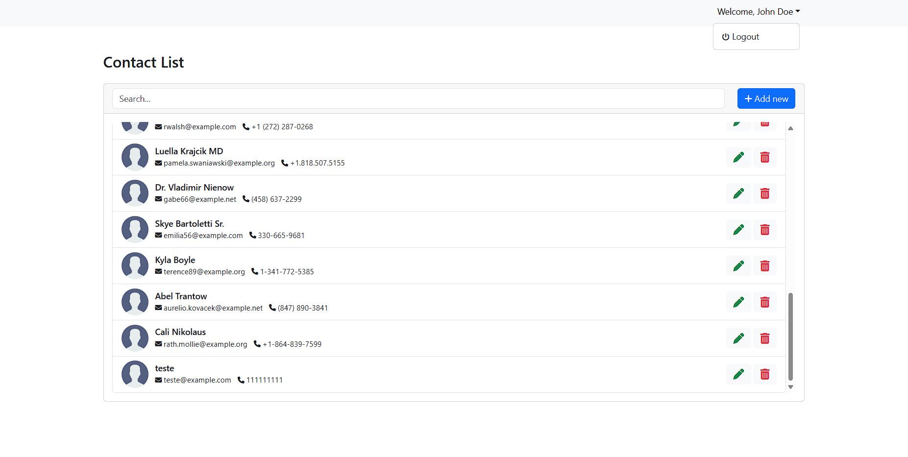

## Contact Manager App

Laravel web application developed to manage contacts.

## Application Features

1. Index Page: Displays a list of existing contacts.
2. Add Contact: Provides a form to add new contacts.
3. Edit Contact: Allows editing an existing contact record.
4. Delete Contact: Enables the deletion of an existing contact record.
5. Login Page: Sign in to unlock contact management! Only logged-in users have the power to add, edit, and delete contacts.

## Built with
* Laravel 10
* Bootstrap 5.3
* MariaDB 10.6
